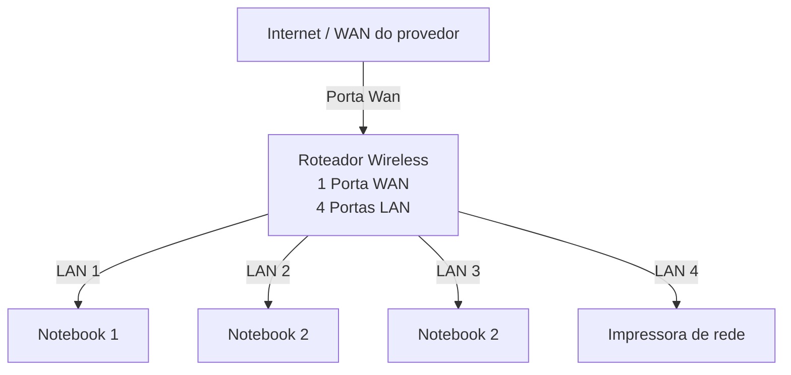

# Laboratório de Redes 01 - Projeto de Rede local
Aluno: Gabriel A.
Professor: José de Assis

Data: 09/03/26

---

## 1. Objetivo
Implementar uma rede local simples conectando 3 notebooks a um roteador wireless com switch e uma impressora de rede.

O projeto será dividido em duas etapas:

1. Simulação da rede no Cisco Packet Tracer
2. Implementação da rede no laboratório real

---

## 2. Equipamentos utilizados neste laboratório:

- 3 Notebooks;
- 1 Roteador wireless com uma porta WAN e quatro portas LAN;
- 1 Impressora de rede;
- Cabos de rede.

---

## 3. Topologia da rede

Diagrama lógico da rede usada neste laboratório:

Imagem da topologia usada neste laboratório:

---
## 4. Plano de endereçamento IP

Rede: 192.168.0.0/24

Gateway: 192.168.0.1

| Dispositivo | Tipo de IP | Endereço IP | Obs. |
|-------------|-------------|-------------|-------------|
| Roteador | Estático | 192.168.0.1 | IP do roteador |
| Impressora | Reserva DHCP | 192.168.0.105 | IP reservado pelo roteador |
| PC1 | Reserva DHCP | 192.168.0.102 | IP reservado pelo roteador |
| PC2 | DHCP | Automático | IP atribuído pelo roteador |
| PC3 | DHCP | Automático | IP atribuído pelo roteador |

**Observação**
- A impressora e um dos notebooks utilizam reserva DHCP.
- O roteador sempre atribui o mesmo endereço IP a esses dispositivos.

---
## 5. Conclusão
Este laboratório permitiu compreender o funcionamento de uma rede local simples, incluindo:

- Estrutura de uma rede doméstica ou pequeno escritório;
- Utilização de um roteador com porta WAN e portas LAN;
- Funcionamento do DHCP;
- Comunicação entre dispositivos na rede local;
- Utilização de uma impressora de rede;
- Compartilhamento de pastas na rede usando o Windows 11;
- Jogos em rede.
