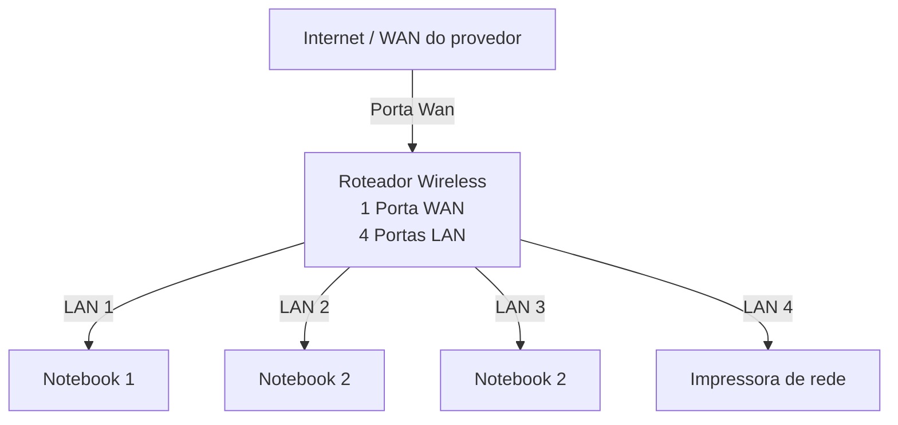

# Laboratório de Redes 01 - Projeto de Rede local
Aluno: Gabriel A.
Professor: José de Assis

Data: 09/03/26

---

## 1. Objetivo
Implementar uma rede local simples conectando 3 notebooks a um roteador wireless com switch e uma impressora de rede.

O projeto será dividido em duas etapas:

1. Simulação da rede no Cisco Packet Tracer
2. Implementação da rede no laboratório real

---

## 2. Equipamentos utilizados neste laboratório:

- 3 Notebooks;
- 1 Roteador wireless com uma porta WAN e quatro portas LAN;
- 1 Impressora de rede;
- Cabos de rede.

---

## 3. Topologia da rede

Diagrama lógico da rede usada neste laboratório:

